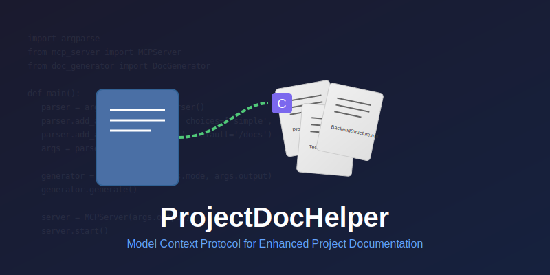

# ProjectDocHelper



[](https://opensource.org/licenses/MIT)
[](https://www.python.org/)
[](https://github.com/stark1937/ProjectDocHelper)
[](https://github.com/stark1937/ProjectDocHelper)

[English](README.md) | [简体中文](README_CN.md)

## 📝 Introduction

ProjectDocHelper is an MCP (Model Context Protocol) server designed to automatically generate project documentation and make it accessible to AI development tools like Cursor through MCP, thereby improving the accuracy and relevance of AI responses.

## ✨ Key Features

- 🚀 **Smart Documentation Generation**: Automatically generates document sets based on project type
- 🔄 **Multiple Generation Modes**: Supports both simple and detailed modes for different needs
- 📊 **Progress Visualization**: Displays progress bar during document generation
- 🔌 **MCP Service Support**: Cursor can access generated documents after service startup
- 📋 **Q&A Integration**: Supports incorporating user-AI interactions into documentation

## 🛠️ Tech Stack

- Python 3.12+
- argparse: Command-line argument parsing
- Jinja2: Template engine
- MCP Protocol: Integration with AI tools like Cursor

## 🚀 Quick Start

### Installation

```bash
pip install projectdochelper
```

### Basic Usage

```bash
# Generate project documentation (simple mode)
projectdochelper generate --mode simple

# Generate project documentation (detailed mode)
projectdochelper generate --mode detailed

# Start MCP server
projectdochelper serve --port 8080
```

## 📚 Document Generation

ProjectDocHelper generates different document sets based on project type:

| Project Type | Generated Documents |
| ------------ | ------------------- |
| Frontend     | ProjectRequirements.md, FrontendGuidelines.md, TechStack.md |
| Backend      | ProjectRequirements.md, BackendStructure.md, TechStack.md |
| Full Stack   | ProjectRequirements.md, FrontendGuidelines.md, BackendStructure.md, TechStack.md |

## 🔗 Cursor Integration

1. Start ProjectDocHelper service
2. Configure MCP service address in Cursor
3. Start enjoying enhanced AI-assisted development

## 📋 Q&A Integration Feature

ProjectDocHelper intelligently integrates user-AI interactions into relevant documentation:

- Automatically identifies relevant Q&A content
- Adds valuable information to corresponding documents
- Maintains structured and readable documentation

## 🤝 Contributing

Contributions are welcome! Please check out our Contributing Guide for details.

## 📄 License

This project is licensed under the MIT License - see the LICENSE file for details.

💡 Note: ProjectDocHelper is under active development. Feedback and suggestions are welcome!